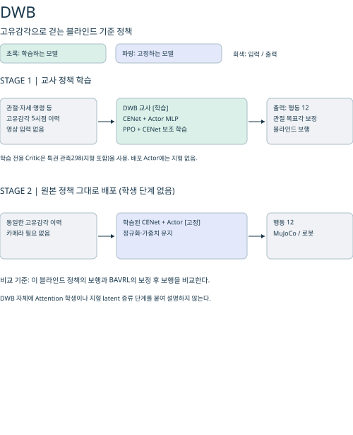
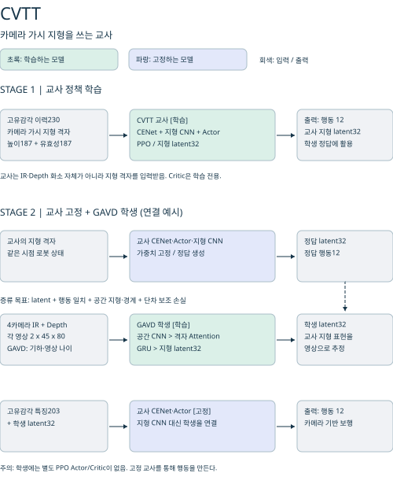
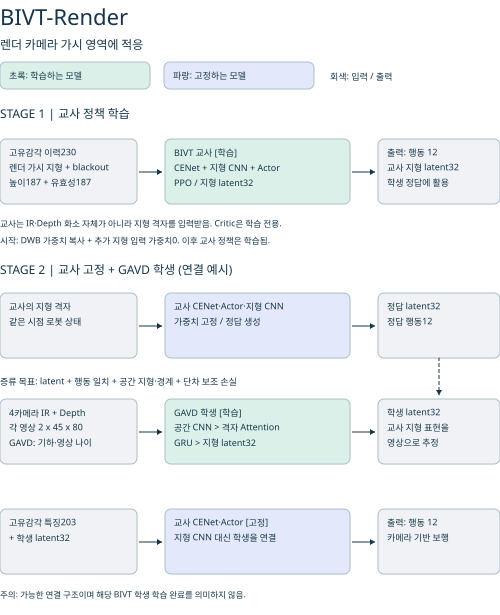
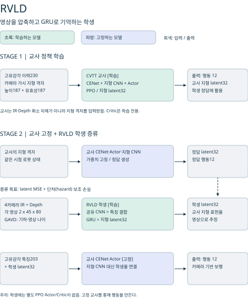
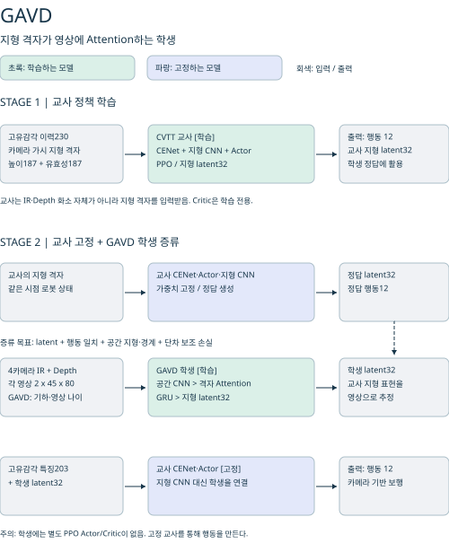
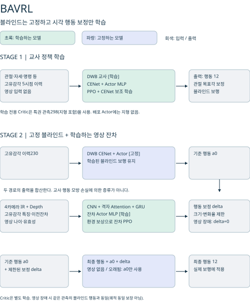
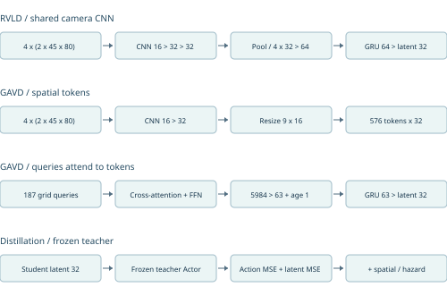
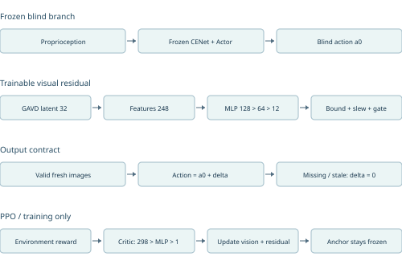

# RBQ10 학습 방법 비교

2026-09-30 · 5090 로컬 코드/체크포인트/실험 로그 기준

## 1. 읽는 법과 핵심 결론

이 약어들은 논문 공인 명칭이 아니라 프로젝트 내부 분류다. DWB·CVTT·BIVT는 교사 정책의 출처, RVLD·GAVD는 학생 증류 방식, BAVRL은 고정 블라인드 정책에 시각 잔차 행동을 더하는 RL 방식이다. 따라서 같은 층위의 여섯 알고리즘으로 순위를 매기면 안 된다.

- CVTT-6987 + GAVD-20000: 비전 교사 정책에 카메라 지형 latent 학생을 연결한다.
- DWB-38000 + BAVRL: 블라인드 CENet·Actor를 고정하고 시각 행동 보정만 학습한다. latent 교사 증류가 아니다.
- BIVT 교사 학습 20,000회와 GAVD 학생 증류 20,000회는 별도 단계다. BIVT 세 종류의 GAVD 20,000회 증류가 실행됐다는 의미가 아니다.
- 1이터의 단위가 다르다. 교사 PPO는 병렬 환경 rollout와 여러 SGD 갱신, 학생 증류는 촬영 횟수, BAVRL은 짧은 rollout와 잔차 PPO 갱신이다. 이터 수만 같다고 공정한 계산량 비교가 되지 않는다.
- base_contact 종료율과 갭 통과 성공률은 서로 다르다. 갭 지형에서 접촉 없이 timeout된 에피소드를 갭 통과 성공으로 계산하지 않는다.

## 2. 이름과 역할

| 약어 | 전체 이름 | 역할 |
|---|---|---|
| DWB | DreamWaQ Blind Baseline | 고유감각 기반 블라인드 보행 기준 정책 |
| CVTT | Camera-Visible Terrain Teacher | 카메라에서 보이는 지형 정보를 이용하는 교사 |
| BIVT | Blind-Initialized Visual Teacher | 블라인드 정책에서 초기화한 지형 관측 교사 |
| BIVT-Full | BIVT, Full Terrain (2-A) | 완전한 지형 관측을 쓰는 초기 적응 단계 |
| BIVT-Render | BIVT, Render Visibility (2-B) | 렌더 기반 가시성 및 blackout을 쓰는 교사 |
| BIVT-Ray | BIVT, Raycast Visibility (2-R) | 렌더 대신 raycast 가시성을 쓰는 교사 |
| RVLD | Recurrent Visual Latent Distillation | 공유 CNN + GRU 지형 latent 학생 |
| GAVD | Grid-Attention Visual Distillation | 공간 CNN + 격자 cross-attention + 기억 학생 |
| BAVRL | Blind-Anchored Visual Residual Learning | 동결 블라인드 보행 + 영상 잔차 PPO |

BIVT-Render v1/v2는 같은 네트워크의 실험 분기다. v1은 blackout 없는 Full 모델, v2는 blackout 있는 Full 모델에서 시작한다. Render 단계는 둘 다 blackout을 쓴다. 장기 PPO는 Ray 보완을 우선하고 Render는 소규모 비교 기준으로 유지한다(서버 전달 설계, 실행 변경 아님).

<!-- pagebreak -->

<!-- pagebreak -->

<!-- pagebreak -->

<!-- pagebreak -->

<!-- pagebreak -->

<!-- pagebreak -->

<!-- pagebreak -->

<!-- pagebreak -->

<!-- pagebreak -->

## 3. 교사 입력·신경망·PPO

### 3.1 공통 DWB 구조

참고: [DreamWaQ — Nahrendra·Yu·Myung, 2023](https://arxiv.org/abs/2301.10602)은 기반 방법이다. [PPO — Schulman 외, 2017](https://arxiv.org/abs/1707.06347)은 정책 최적화의 기반이다. 아래 차원·payload·설정은 논문 수치를 옮긴 것이 아니라 로컬 `rl/actor_critic.py`, `rl/cenet.py` 및 저장 체크포인트를 기준으로 한다.

한 시점의 정책 관측은 46차원이다: 각속도3 + 중력방향3 + 속도명령3 + 관절위치12 + 관절속도12 + 이전행동12 + payload1. 5시점 이력은 230차원이다. Actor가 직접 쓰는 최근 4시점은 184차원이다.

CENet은 관측 이력230 → MLP128 → 64 → 속도 추정3 및 latent16을 출력한다. latent에는 평균16/로그분산16의 VAE 분기가 있으며, 재구성 decoder는 코드19 → 64 → 128 → 다음 관측46이다. 속도 회귀·재구성·KL로 학습하며, 추론 때는 결정론적 평균을 사용한다.

Actor는 최근 관측184 + CENet 코드19 = 203 → 512 → 256 → 128 → 행동12, ELU MLP다. 초기화 로그에 먼저 찍히는 부모 Actor의 230 입력과 실제 교체된 Actor203을 혼동하지 않는다. Critic은 privileged 관측298 → 512 → 256 → 128 → V1이다. 여기에는 실제 선속도, 발 주변 높이/접촉/힘, 마찰, 질량, 게인, 외란 및 높이 스캔이 들어간다. 블라인드라는 말은 배포 Actor의 입력에 지형 영상이 없다는 뜻이지 학습 Critic까지 지형을 모른다는 뜻은 아니다.

저장된 DWB-38000 설정: clipped PPO ε=0.2, GAE γ=0.99/λ=0.95, 5 epochs, 4 minibatches, lr=0.001 adaptive KL(target0.01, 최소lr0.00003), entropy0.01, clipped value loss 계수1, grad norm1, 좌우 대칭 augmentation. rollout=100 steps/env. CENet은 별도 학습률0.001, β=1이며 AdaBoot를 사용한다. 실제 다른 실행은 저장된 agent.yaml을 우선한다.

### 3.2 CVTT 구조

참고: [DreamWaQ](https://arxiv.org/abs/2301.10602)와 [PPO](https://arxiv.org/abs/1707.06347)를 기반으로 한 프로젝트 확장이다. CVTT라는 이름의 별도 원논문은 확인되지 않았다. 구현 레퍼런스는 `src/gd_lab/teachers/cvtt/actor_critic.py`다. 카메라 가시 지형 마스킹과 latent32 연결을 DreamWaQ 원논문 자체의 구조라고 해석하지 않는다.

Actor 기본 관측과 CENet은 DWB와 같은 계열이다. 추가로 높이187 + 유효성187 = 374차원의 terrain 관측을 받는다. 11×17 격자의 2채널 입력 → Conv2d 2→8→16 (3×3, ReLU) → 5×8 pooling → Flatten640 → MLP64 → latent32(tanh)이다.

Actor는 203+32=235 → 512 → 256 → 128 → 12. Critic은 기존 privileged 입력298을 사용한다. PPO gradient가 terrain encoder까지 갱신한다. 렌더 영상 자체를 CNN Actor에 직접 넣는 교사가 아니라, 영상으로 정한 가시 영역의 지형 격자를 사용하는 구조다. 정책·PPO 기본 설정은 DWB를 상속하지만 rollout/env 수/다중 GPU 설정은 실행별로 다를 수 있다.

### 3.3 BIVT 구조

참고: 블라인드 기반은 [DreamWaQ](https://arxiv.org/abs/2301.10602), 학습 기반은 [PPO](https://arxiv.org/abs/1707.06347)다. Full·Render·Ray 세 변형은 프로젝트 구현이며 별도 원논문을 확인하지 못했다. 구현 레퍼런스는 `teachers/bivt/blind_init.py`, `actor_critic.py`, `tasks.py`와 `docs/teachers/bivt.md`다.

초기화에서는 블라인드 가중치를 복사하고 Actor 첫 층의 추가 지형 입력32열을 0으로 설정한다. 따라서 초기 행동은 블라인드와 같지만, 학습 후까지 동일성을 보장하지는 않는다. 서버 전달 내용 기준 v1은 blackout 없는 Full 사전학습 모델, v2는 blackout 있는 Full 모델에서 출발한다. Render 단계에서는 둘 다 blackout을 사용한다.

CVTT 계열 Actor235 및 terrain CNN을 사용하되, 기존 블라인드 정책에서 초기화한다. 모든 지형 셀이 무효이면 terrain latent를 정확히 0으로 gate한다. 학습 중 blackout을 포함하여 무지형 관측에서 보행을 학습한다.

공통 높이187개는 지형 메시 raycast로 얻는다. Render는 렌더 Depth로 높이 격자의 가시성을 판정한다. 공통 경로에서 생성하는 RGB 기반 IR proxy는 교사 지형 인코더 입력이 아니며 실제 IR 센서 시뮬레이션과 다르다. Ray는 카메라 투영·거리·지형 가림과 다리 캡슐·주변 4개 픽셀 방향을 검사한다. 전체 높이맵을 무조건 주지 않으며 몸통 등 자기 가림은 보완 대상이다.

PPO는 Actor·Critic·지형 인코더를 갱신하고 CENet은 별도 보조 손실로 학습한다. 블라인드 초기화는 Actor 동결이 아니다. latent0에서도 원래 DWB 행동을 보장하지 않으며, 이는 블라인드를 동결하는 BAVRL과 다르다. Blackout은 칸별 무작위 제거가 아니라 일정 시간 또는 일부 에피소드 동안 지형 입력 전체를 차단한다.

## 4. 학생과 잔차 학습 방법

### 4.1 RVLD: 공유 CNN + GRU

참고: `students/rvld/model.py` 주석은 [APT-RL: Agile perceptive multi-skill locomotion for quadrupedal robots in the wild — Kang 외, 2026](https://arxiv.org/abs/2607.13579)의 교사-학생 분리(Fig. 2iii)를 명시적으로 언급한다. 이는 전체 APT-RL 재현을 뜻하지 않는다. 로컬 RVLD에는 해당 논문의 전체 action pretraining·다중 스킬 Transformer 파이프라인이 없다. [Cho 외, 2014](https://arxiv.org/abs/1406.1078)는 GRU의 기반 레퍼런스이며 프로젝트의 직접 인용으로 확인된 것은 아니다.

학생 입력은 4카메라 × (Depth, IR proxy) × 45×80이다. 시뮬레이션 IR은 렌더 grayscale proxy이며 실제 적외선 센서의 광학 현상을 완전히 복제한 것이 아니다.

카메라마다 가중치를 공유하는 Conv 2→16(k5,s2)→32(k3,s2)→32(k3,s2), ReLU, pooling3×5, Flatten480→32를 거친다. 4개 특징을 연결한128 →64 → GRUCell64→latent32(tanh). 보조 hazard head는64→16→1로 최대 인접 높이 단차를 예측한다.

고정 교사 terrain latent에 대한 MSE와 hazard 보조 손실로 학생을 학습한다. 배포에서는 기존 교사 CENet·Actor를 유지하고 terrain encoder 대신 학생 latent를 연결한다. 학생 자체에는 별도 PPO Actor/Critic이 없다. 촬영/지연 packet 단위 학습이며 GRU BPTT와 학습률은 실행 설정을 확인해야 한다.

### 4.2 GAVD: 격자 Attention 학생

참고: 프로젝트 자체 학생 구조다. [Attention Is All You Need — Vaswani 외, 2017](https://arxiv.org/abs/1706.03762)은 scaled dot-product attention의 기반 레퍼런스이며, 전체 Transformer를 재현하지 않는다. [DAgger — Ross·Gordon·Bagnell, 2011](https://arxiv.org/abs/1011.0686)은 학생이 방문한 상태에 교사 정답을 붙이는 방식과 관련된 개념이다. 현재 구현은 고전적 데이터셋 누적 DAgger의 그대로인 구현은 아니다. 두 논문 모두 직접 참조 이력이 확인된 것으로 표기하지 않는다. 실제 구현은 `students/gavd/model.py`, `distillation.py`다.

입력 영상은 RVLD와 같다. CNN 2→16→32 (3×3,s2, ELU)로 공간 특징을 유지하고, 카메라마다144 token, 총576 token을 만든다. 카메라 ID embedding과 기하정보8차원(xyz, 광선방향, 유효성/unknown)을 더한다.

11×17=187개 지형 query가 32차원 key/value에 scaled dot-product cross-attention을 수행한다. 현재 구현은 단일 attention이며 대형 multi-head Transformer가 아니다. LayerNorm + FFN32→64→32 뒤 공간 head가 높이·유효성·상승경계·하강경계·지지면 proxy의5개 값을 출력한다.

187×32 특징 →63, 영상 나이를 포함해 입력64 → GRUCell(hidden63) → latent32. 외부 인터페이스 기억64의 마지막 슬롯은 출력 시 0으로 예약되며, 실제 시간 입력은 별도로 제공한다. 정확한 자세 보정 BEV 역투영은 아니며 카메라 기하 embedding을 사용한다. CNN 출력은 bilinear 보간으로9×16이 된다(pooling이 아님). 상승·하강 경계 지도는 x방향 인접 높이 차이 기준이며 지지면은 평탄성 proxy다.

확인한 실행의 목표는 latent MSE + 0.5×hazard MSE + 행동 MSE + 0.5×공간 손실이다. 고정 Actor에 학생 latent를 넣은 행동이 교사 행동을 따르도록 한다. 초기1,000 촬영 이후4,000 촬영에 걸쳐 학생 행동 rollout 비율을 올린다. 카메라별8% drop augmentation, packet 지연/누락을 적용한다. lr0.0003, BPTT8, 64env, 촬영70~100ms, 지연0~150ms, packet drop5%다. capture 수와 optimizer 갱신 수는 같지 않다.

### 4.3 BAVRL: 고정 블라인드 + 행동 보정

참고: 고정 기준 정책은 [DreamWaQ](https://arxiv.org/abs/2301.10602), 최적화는 [PPO](https://arxiv.org/abs/1707.06347) 기반이다. [Residual Reinforcement Learning for Robot Control — Johannink 외, 2018](https://arxiv.org/abs/1812.03201)은 기존 제어에 학습 잔차를 더한다는 관련 개념 레퍼런스다. 직접 참조 이력이나 그 논문의 정확한 재현으로 확인한 것은 아니다. 동결 CENet·Actor, 영상 freshness gate와 제한된 보정은 로컬 `residuals/bavrl/model.py`, `ppo.py` 구현을 따른다.

현재 설정은 이터당512개 transition에4 epochs×16 minibatches=64 optimizer 갱신이다. BAVRL value loss는 일반 MSE이며, DWB의 clipped value loss와 구분한다.

학생 latent를 교사 latent에 맞추는 증류가 아니다. DWB-38000 CENet·Actor·관측 정규화는 동결하고 GAVD 시각 인코더와 잔차 MLP를 환경 보상으로 학습한다.

잔차 Actor 입력은 블라인드 특징203 + 영상latent32 + 이전잔차12 + 나이1 = 248 →128→64→12 (ELU). 최종층은0 초기화. 행동은 동결 블라인드 행동 + 제한된 잔차다. tanh 잔차 한계±0.2, tick당 변화±0.02는 policy action 단위이며 scale0.25 적용시 관절각 최대 보정±0.05rad이다.

Critic은 블라인드 Critic298→512→256→128→1의 독립 복사본을 학습한다. PPO는 raw Gaussian sample의 log-probability를 사용한다. lr0.0003, clip0.2, γ0.99, λ0.95, value0.5, entropy0.001, 잔차 크기/변화 penalty0.01, 공간 보조0.1, gradient clipping1. 현재32env×horizon16=512 transitions/iter, 4epochs, batch32다.

영상 없음/invalid/250ms 초과 시 잔차와 이전잔차를0으로 만들어 같은 관측에서 원래 블라인드 행동과 같게 한다. 물리 상태까지 원래 블라인드 궤적으로 돌아간다는 보장은 없다. 이 즉시 복귀가 slew 제한보다 우선하므로 전환 충격은 별도 검증 대상이다. 현재 GRU는 단일 촬영 truncated gradient이고 긴 sequence BPTT가 아니다. 학습 기본 지연0~100ms, packet drop5%이며 카메라별 고장 augmentation은 아직 없다.

## 5. 확인한 모델 파일과 상태

| 경로/방법 | 교사 파일 | 학생·잔차 파일 / 상태 |
|---|---|---|
| DWB → BAVRL | teachers/blind/arm4_38000/teacher/model_38000.pt | bavrl_1000.pt 시험 완료; 총20,000회 재개 중 |
| CVTT → GAVD | 6987_top1.pt (launch 복사본 teacher.pt) | perception_20000.pt, 64env 증류 완료 |
| CVTT → RVLD | 배포 평가 패키지 model_5674_top1.pt | perception_20000.pt, env128 버전 평가 기록 |
| CVTT → RVLD 과거 | model_3700.pt / model_3879_top1.pt / model_4125_top2.pt | 각각12400/20000/20000 학생 패키지 보유 |
| BIVT-Render v1 로컬 수신본 | teachers/bivt/render_v1_final_20260930/teacher/model_1299.pt | strict load 확인; 대응 GAVD 학생 미확인 |
| BIVT-Ray / Render v2 | 다중 GPU 담당에게 현재 파일 확인 요청 | 로컬에 없는 모델을 임의로 짝짓지 않음 |

표의 Top1/Top2는 해당 보관 파일명이다. 과거 대화의 랭킹 표현이 달라도 임의로 파일명을 바꾸지 않는다. online Top5 점수는 학습 rollout proxy이며 held-out 검증 순위가 아니다.

BAVRL 현재 run: `logs/bavrl/dwb38000_bavrl_20000_resume1000_20260930/`. 1,000회 체크포인트에서 추가19,000회로 총20,000회를 목표로 한다. 문서 조사 중3,221회 로그와 `bavrl_3200.pt` 저장을 확인했다. 이후 숫자는 계속 바뀐다. 원래1,000회 배포 번들과 전용 스크립트는 유지한다.

## 6. 이터 시간과 예상 학습 시간

| 방법 | 실측 단위/조건 | 초/이터 | 요청한 기준 시간 |
|---|---|---|---|
| DWB 교사 | 실행 로그 시간 미확인 | 미확인 | 40,000회 산출 보류 |
| CVTT 교사 | 다중 GPU 담당 확인 대상 | 미확인 | 40,000회 산출 보류 |
| BIVT 각 교사 | 다중 GPU 담당 확인 대상 | 미확인 | 40,000회 산출 보류 |
| RVLD 학생 | env128 패키지 보유, 학습 시간 로그 미확인 | 미확인 | 20,000회 산출 보류 |
| GAVD 학생 | 5090,64env,20,000 captures, learning wall7797.65초 | 0.3899 | 2시간9분58초 실측 |
| BAVRL 잔차 PPO | 5090,32env,horizon16,50→1000 저장 시간975초/950회 | 1.0263 | 총20,000회 환산5시간42분; 잔여19,000회5시간25분 |

BAVRL은 학생 증류 시간이 아니라 잔차 RL 시간이다. 초기화·평가·export·기타 GPU 부하를 제외한 단순 환산이며, 잔여는 여유를 두어5.5~6.5시간으로 안내했다. 재개 시 물리 상태·curriculum·센서 queue/RNG는 복원하지 않는다. 시간을 늘린다고 특정 지형 성공을 보장하지 않는다.

비교 공식: 교사40k시간=실측 초/이터×40,000÷3,600. 학생20k시간=실측 초/capture×20,000÷3,600. PPO에서 transitions/iter=전체env×horizon이며 GPU별env인지 전체env인지 먼저 확인한다. GPU 종류/개수와 학생의 촬영·BPTT 수가 다르면 이터 시간을 직접 비교하지 않는다.

## 7. 실험 결과와 해석

### 7.1 CVTT-5674 + RVLD-20000: Isaac 고정 난도 평가

2026-09-29 저장 자료, 난도0.65, 전체256env, 6,000 simulation steps, 학생 입력 지연0~50ms/drop5%. 분모는 각 조건의 완료 에피소드 수다. 지형별 평균을 다시 평균하지 않고 종료 건수를 합산했다.

| 입력 조건 | 전체 base_contact / 종료에피소드 | 전체율 | 갭 base_contact / 갭 종료에피소드 | 갭 접촉 종료율 |
|---|---|---|---|---|
| 교사 terrain latent | 26 / 201 | 12.94% | 4 / 63 | 6.35% |
| RVLD 카메라 학생 | 16 / 196 | 8.16% | 2 / 63 | 3.17% |
| 지형 모양 제거 flatscan | 27 / 200 | 13.50% | 8 / 65 | 12.31% |
| terrain latent=0 | 1877 / 1887 | 99.47% | 941 / 942 | 99.89% |

이 자료만으로 RVLD가 교사보다 낫다고 일반화할 수 없다. 표본·지형 배치 및 stochastic rollout의 차이가 있고 반복 seed 신뢰구간이 없다. 하지만 이 조건에서 지형 latent 제거가 크게 악화되는 증거다. latent0은 DWB 모델이 아니다. CVTT Actor에 비정상 입력을 준 것이므로 블라인드 모델 성능으로 인용하면 안 된다.

### 7.2 RVLD의 MuJoCo 영상 대조

2026-09-30 07:05 기록, 같은 CVTT-5674+RVLD env128 배포. 평지 live는 목표x4.7m 도달. 계단 live는 x4.139m에서 시간 종료(목표 미달), 계단 flat 영상은 x2.777m에서 자세/속도 한계로 중단. 갭 live/flat은 각각x2.489/x2.057m에서 횡방향/높이 한계로 중단했다.

이 비교는 영상 조건이 보행에 영향을 준다는 관찰이며, 갭 통과 성공을 입증하지 않는다. 단일 시행을 통계적 base_contact율로 바꾸지 않는다. 따라서 RVLD가 모든 방법 중 가장 나쁘다는 순위도 확정할 수 없다.

### 7.3 BAVRL-1000 MuJoCo 결과

2026-09-30 21:50 기록. 4카메라 실제 MuJoCo IR+Depth 입력, 공통 지형 원점 평지, Arm4 gain, payload6kg, 100Hz Actor. 속도0 WALK20초: 최대 roll/pitch0.919°, 관절속도0.532rad/s. 0.18m/s 전진30초: 최대 기울기3.994°, 관절속도10.239rad/s, yaw 최대18.40°. 전도/자동중단 없이 STAND 복귀했지만 방향 편차가 남았다.

별도 학생 수신 probe의60초 표본11790개에서 missing0, 최대age381ms, age≥250ms1990개(16.9%)였다. 이는 별도 인스턴스 수치이며 Pilot의 정확한 fallback 비율은 아니다. Pilot에서도310~336ms 및 freshness 전환 로그를 확인했다.

base_contact율·갭 종료율은 미측정이다. 첫 갭x12m에 도달하지 않은 평지 테스트를 갭 성공률0%/100%로 환산하지 않는다. 무영상 residual0은 ONNX 계약 검사로 확인했으나 스트림 차단 보행은 미실시다. 계단/갭 및20,000회 모델 성능은 아직 미검증이다.

### 7.4 GAVD-20000

학습 완료 로그의 마지막 latent MSE0.02653, hazard MSE0.00327은 증류 오차이지 접촉 종료율이 아니다. 현재 수집한 자료에서는 GAVD 전용 base_contact·갭 종료율을 확인하지 못했다. RVLD 실험 결과를 GAVD 결과로 옮겨 쓰지 않는다.

## 8. 장점·단점·선택 기준

| 방법 | 장점 | 단점·주의 |
|---|---|---|
| DWB | 카메라/지연에 독립적, 비교 기준이 단순 | 접촉 전 갭·계단을 직접 미리 볼 수 없음 |
| CVTT | 지형 latent와 행동을 PPO로 함께 최적화 | 렌더 비용, 교사-카메라 학생 간 차이, latent 누락 취약 가능 |
| BIVT-Full | 이미 학습한 블라인드에서 시작 | 완전 지형에서 제한된 시야로 바뀔 때 분포 차이 |
| BIVT-Render v1·v2 | Depth 가시성·blackout 학습, 소규모 비교 역할 유지 | 학습 수행 이력 있음; 렌더 비용으로 장기 우선순위 하향, 성능 열등 판정 아님 |
| BIVT-Ray | 렌더 없는 가시성 학습, 장기 PPO 보완 우선 | 다리 캡슐·4방향 검사 구현; 몸통 등 개선안은 미검증 |
| RVLD | 작은 CNN-GRU, 기존 Actor에 연결 쉬움 | 공간 압축으로 작은 경계가 소실될 수 있음; 단순 latent 손실 |
| GAVD | 공간 격자·행동·경계 지도를 함께 학습 | query 기하 오차, 연산/지연, 증류가 교사보다 나은 행동을 보장하지 않음 |
| BAVRL | 블라인드 동결, 영상 장애 시 정확한 행동 복귀 계약 | 작은 보정 한계, 지연 경계 전환, 현재짧은 기억학습·성능 미검증 |

다음 공정 비교는 동일 지형/seed/명령/게인/payload/카메라·지연 조건에서 각 정책을 반복 평가하고, 완료 에피소드와 갭 진입/통과 횟수를 별도로 저장하는 방식이다. 계산 예산 비교에는 env-steps·촬영 수·SGD 갱신 수·GPU시간을 함께 보고한다.

## 9. 출처와 미확인 범위

소스·체크포인트 대조: DWB Actor 첫 가중치512×203, CVTT512×235, 공통 Critic512×298, BAVRL 잔차128×248을 확인했다. GAVD GRU의 입력 가중치189×64는 hidden63의 세 gate와 일치한다. CENet 코드에는 PPO gradient를 흘리지 않으며 보조 손실로 학습한다. 관측 이력은 term-major 저장이고 Actor에는 최근4개를 최신순으로 전달한다. CVTT terrain 관측은 Critic 입력과 별도 그룹이다.

논문 링크는 각 방법 바로 아래에 배치했다. ‘기반’은 구성 알고리즘의 출처, ‘명시 참조’는 코드 주석으로 확인된 연결, ‘관련 개념’은 이해를 돕기 위한 비교다. 프로젝트 내부 약어를 논문의 공식 알고리즘명이나 저자들의 구현으로 오인하지 않는다. 구조도의 수치는 논문이 아니라 로컬 구현을 나타낸다.

로컬 학습 루트: `/home/user/gd_project/gd_lab_vrl`. 배포 루트: `/home/user/gd_project/gd_rbq10_deploy_vrl`. 아래는 로컬 상대경로다.

- 약어: README.md; 구조: src/gd_lab/agents/dreamwaq_ppo_cfg.py, methods/dreamwaq/spec.py, rl/actor_critic.py, rl/cenet.py.
- 교사: src/gd_lab/teachers/cvtt/actor_critic.py, bivt/actor_critic.py, bivt/blind_init.py; DWB checkpoint의teacher/params/agent.yaml.
- 학생: src/gd_lab/students/rvld/model.py, gavd/model.py, gavd/distillation.py, scripts/distill_student.py.
- BAVRL: src/gd_lab/residuals/bavrl/model.py, ppo.py, scripts/train_bavrl.py; logs/bavrl/의run.json 및체크포인트.
- GAVD 시간: logs/arm4_teacher6987_attention_20k_20260930.console.log의learning_wall_seconds=7797.65 및 해당run의params/env.yaml.
- 평가율: 배포logs/isaac_eval_5674_env128_20260929_232120/diff_0.65.json; experiments/isaac_eval/eval_latent_sources.py.
- 영상 대조: 배포logs/terrain_vision_check_20260930_070515/config.json, summary.json.
- BAVRL 시험: 배포bavrl/README.md 및logs/bavrl1000_walk_zero.json, bavrl1000_forward.json.

다중 GPU 담당 대화 '다중 GPU 비전 RL 학습 모니터'에 원격10.77.32.231의 실행 설정·시간·성능을 요청했다. 두 차례 요청 모두 완료 상태로 표시됐으나 답변 본문이 비어 반환됐고, 요청한 공유 자료 파일도 생성되지 않아 이번 판본에는 원격 실측을 확정하지 못했다. 해당 항목은 미확인으로 남겼다. 로컬 코드 기본값만으로 원격 실행의 실제 설정을 확정하지 않는다. 본 문서는 로컬 근거 기반 1차본이며 원격 담당의 유효 응답 수신 후 보완이 필요하다.

<!-- pagebreak -->

## 추가: 교사·학생·시각 보정 조합표 (2026-10-02 갱신)

출발 정책, 교사 학습, 학생 증류, 시각 행동 보정은 서로 다른 축이다. GAST는 교사·학생을 포함하므로 GAST 교사와 GAST 학생을 구분한다. 조합 가능은 연결·학습·배포 검증 완료를 뜻하지 않는다. 앞 절은 당시 기록이며 현재 상태는 이 갱신을 우선한다. 원격 실행 상태는 이번 로컬 확인에 포함하지 않았다.

| 번호 | 출발 정책 | 교사 학습·추가 학습 | 학생·보정 방식 | 시각정보 활용 방식 | 현재 상태·우선순위 |
| --- | --- | --- | --- | --- | --- |
| 1 | DWB | 없음 | 없음 | 영상 없이 자기수용 관측·CENet으로 보행 | 블라인드 기준선 배포 가능 |
| 2 | DWB | DWB Actor·CENet 고정 | BAVRL | 영상으로 잔차 행동을 생성하고 PPO로 학습 | DWB-38000 기반 20,000회 모델 배포·시험 |
| 3 | DWB | BIVT-Full | RVLD | 전체 높이스캔 교사를 CNN-GRU 영상 학생으로 증류 | 조합 가능, 별도 학생 실험 필요 |
| 4 | DWB | BIVT-Full | GAVD | 전체 높이스캔 교사를 격자 Attention 학생으로 증류 | 조합 가능, 별도 학생 실험 필요 |
| 5 | DWB | BIVT-Full | GAST 학생 | 전체 높이스캔 교사를 시공간 Attention·격자 기억 학생으로 증류 | 비교 후보. 학생에게 보이지 않는 교사 정보에 주의 |
| 6 | DWB | BIVT-Render v1·v2 | RVLD | 렌더 Depth로 가시성을 판정한 높이스캔 교사 → CNN-GRU | 로컬 v1 교사 보유. 장기 학습 우선순위 낮음 |
| 7 | DWB | BIVT-Render v1·v2 | GAVD | 같은 교사 → 격자 Attention 학생 | 학생 조합 실험 필요. 소규모 비교용 |
| 8 | DWB | BIVT-Render v1·v2 | GAST 학생 | 같은 교사 → 좌표 보정된 공간 기억·시간 기억 학생 | 조합 후보. 소규모 비교용 |
| 9 | DWB | BIVT-Ray | RVLD | 렌더링 없는 가시성 계산 교사 → CNN-GRU | 4500·보완 7986 교사 보유. 해당 학생 실험 필요 |
| 10 | DWB | BIVT-Ray | GAVD | Ray 가시 지형 교사 → 격자 Attention 학생 | 4500 → 학생 20,000회 배포 완료 |
| 11 | DWB | BIVT-Ray | GAST 학생 | Ray 가시 지형 교사 → 시공간 Attention·격자 GRU 기억 | 4500 → 20,000회 배포·평지 스모크 통과 |
| 12 | DWB | 보완 BIVT-Ray | GAST 학생 | 몸통·발 가림, 경계 판정 등을 보완한 교사 → GAST 학생 | 7986 → 20,000회 증류 중. 현재 우선 실험 |
| 13 | CVTT 경로 | 선택한 CVTT 교사 고정 | RVLD | 렌더 기반 가시 지형 교사 → CNN-GRU | 7761 → 학생 20,000회 배포 완료 |
| 14 | CVTT 경로 | 선택한 CVTT 교사 고정 | GAVD | 같은 교사 → 격자 Attention 학생 | 7761 → 학생 20,000회 배포 완료 |
| 15 | CVTT 경로 | 선택한 CVTT 교사 고정 | GAST 학생 | 같은 교사 → 시공간 Attention·격자 기억 학생 | 준비·단기 실행 이력 있음. 해당 조합 완성 배포 없음 |
| 16 | 새 정책 초기화 | GAST 교사 | GAST 학생 | 노이즈·가림이 있는 높이스캔의 시공간 특징을 교사가 학습하고 영상 학생으로 증류 | 파이프라인 구현. 장기 교사 학습의 우선 검토 경로 |

16행은 교사 버전과 현재 실행을 구분한 실험 목록이며 독립적인 16개 아키텍처를 뜻하지 않는다. 11·12번은 서로 다른 Ray 교사의 비교다. Render v1/v2 및 체크포인트별 비교는 별도로 확장 가능하다.

BAVRL에도 학습되는 시각 네트워크가 있지만 RVLD/GAVD 학생 증류와는 다르다. DWB의 CENet·Actor를 고정하고 환경 보상으로 행동 보정을 학습한다. CVTT + BAVRL 또는 학생 위에 BAVRL을 추가하는 조합은 현재 구현된 경로가 아니며 별도 설계가 필요하다.

## 추가: CVTT·Render 한계와 우선 실험 방향

| 방식 | 장점 | 한계·주의 | 권장 역할 |
| --- | --- | --- | --- |
| BIVT-Full | 교사 학습에 영상 렌더링이 필요 없음 | 학생에게 보이지 않는 지형까지 교사가 사용해 증류가 어려울 수 있음 | 상한 성능·관측 차이 비교 |
| CVTT | 카메라에서 볼 수 있는 지형으로 교사 정보를 제한 | 교사는 높이·유효성 마스크를 쓰지만 가시성 계산에 렌더링 비용 발생. RGB 기반 IR proxy가 교사 입력에 직접 쓰이지 않는다면 그 생성 비용의 효용이 제한적 | 기존 교사를 비교 기준으로 유지, 신규 장기 학습 우선순위 하향 |
| BIVT-Render | 렌더 Depth를 이용해 가림을 반영 | 많은 병렬 환경에서 렌더링 비용이 큼. 교사가 Depth·IR 영상을 직접 인코딩하는 것은 아님 | 소규모 가시성 검증·Ray 비교 기준 |
| 보완 BIVT-Ray | 교사 PPO에서 영상 렌더링을 분리하고 가시 지형을 제공 | 근사 자기 가림·경계 판정 오차. 보수적으로 판정할수록 실제 보이는 칸도 버릴 수 있음 | 장기 교사 학습 우선 경로 |
| GAST 교사·학생 | 공간 특징과 시간 기억을 함께 학습해 이미 지나간 지형을 활용하도록 설계 | 촬영 시점 자세·좌표 정렬에 민감. 기억 구조가 있다고 후족 갭 극복이 보장되지는 않음 | 시공간 기억 효과를 검증할 우선 경로 |

- BIVT는 DWB로 초기화하지만 교사 Actor를 고정하지 않는다. Actor·Critic·지형 인코더는 PPO, CENet은 별도 보조 손실로 학습한다. 학생 증류에서 교사를 고정한다.
- GAST 학생을 붙여도 BIVT/CVTT 교사가 시공간 교사로 바뀌지 않는다. BIVT-Ray → GAST 학생과 GAST 교사 → GAST 학생은 별도 실험이다.
- Render 우선순위 하향은 계산 비용 때문이며 성능 열등을 확정한 것이 아니다. v1/v2는 소규모 비교 역할을 유지한다.
- 학생 증류용 Depth·IR proxy 생성 비용은 남는다. RGB 기반 IR proxy의 효용 문제와 실제 IR 센서의 효용은 구분한다.
- 4500 → GAST의 평지 속도0 WALK20초 및 0.18m/s30초 smoke 통과는 갭·계단 성공률 검증이 아니다.
- 7986 → GAST는 교사만 교체하고 516env/BPTT16/시드42/학습률0.0003/촬영70-100ms/지연0-150ms/누락5%를 유지한다. 교사 지연0-50ms와 차이가 있다. 실행 상태는 2026-10-02 기준이다.
- 보완 Ray 소스와 7986 패키지는 수신됐다. 뒤의 10월1일 보완안 절은 당시 제안 기록이며 현재 상태는 본 갱신을 우선한다. 가시성 개선이 정책 성능 향상을 보장하지 않는다.

<!-- pagebreak -->

## 추가: 공정한 비교를 위한 기준 실험

| 기준 실험 | 확인하려는 것 | 해석 시 주의 |
| --- | --- | --- |
| DWB 원본 단독 | 비전 추가 전 보행 성능 | 동일한 DWB 체크포인트를 비교 기준으로 고정 |
| CVTT/BIVT + 정답 지형 입력 | 교사 자체의 갭·계단 극복 능력 | 시뮬레이션 교사 평가이며 카메라 학생 성능이 아님 |
| 같은 교사 + RVLD / GAVD / GAST 학생 | 학생 구조·기억 효과 | 교사·지형·시드·카메라 조건 통일 |
| 정상 영상 / 누락·지연 영상 | 시각정보 기여 및 센서 강건성 | 동일 학생을 고정; 시간초과와 접촉 종료를 분리 |
| 같은 DWB + 보정 없음 / BAVRL | 시각 행동 보정의 실제 이득 | 게인·제어 주기·초기 상태를 통일 |

CVTT-7761의 RVLD와 GAVD는 각각 20,000회 배포가 준비되어 같은 교사 비교가 가능하다. 현재 우선 실행은 보완 Ray-7986 → GAST 학생이다. 5674-RVLD와 6987-GAVD는 교사가 달라 구조만의 효과를 분리할 수 없다.

- Render v1은 model_1299.pt이며 Top-1 선정 모델은 아니다. Ray는 model_4500.pt 및 보완 7986_top1.pt를 보유한다. Full·Render v2 별도 로컬 패키지는 이번 목록에서 확인되지 않았다.
- 새 교사에 기존 학생 가중치를 그대로 붙이지 않는다. 관측·latent·Actor 계약을 확인하고 해당 교사를 대상으로 증류한다.
- 비교 지표는 갭 통과율, 갭·계단 베이스 접촉 종료율, 시간초과율, 이동 거리, 자세·관절 속도 및 영상 지연을 함께 기록한다.
- 20,000회는 실행 길이를 맞추는 기준일 뿐 공정성의 충분조건은 아니다. env 수, 캡처 수, 유효 영상 수, 최적화 횟수와 실제 시간을 함께 기록한다.
- 온라인 Top-5 점수는 학습 rollout 기반 후보 선정 지표이며 독립 평가 성능이 아니다.
- d_v3.6.21_b1_18 기반 BAVRL 신규 학습은 사용자 요청으로 보류 중이다.

<!-- pagebreak -->

<!-- pagebreak -->

## GAST 설계 추가 - 2026-10-01

GAST: Gap-Aware Spatiotemporal Teacher-Student Learning. 프로젝트 신규 설계이며 기존 논문의 공식 명칭은 아니다. 갭뿐 아니라 평지와 계단을 함께 학습한다. 아래는 구현·검증할 사양이며 성능을 검증한 결과가 아니다. 앞 절의 실행 상태는 각 작성 시점의 기록이다.

### 교사 GAST-T: 노이즈 높이스캔 시공간 Denoising Autoencoder

Arm4 설정을 독립 gast/ 디렉토리로 복사한다. 물리 dt 0.005초, 제어 decimation 2(100 Hz), hip Kp 123.39, knee Kp 127.77, Kd 2.4 및 기존 CENet 구조와 보조 학습을 유지한다. 사전 DWB 가중치로 초기화하지 않고 처음부터 학습한다. 교사에는 카메라 센서를 만들지 않는다.

현재·과거 11×17 높이와 유효성 격자를 이동·yaw에 맞춰 현재 좌표로 보정한다. 최근은 촘촘히, 과거는 드물게 선택한 약 5초 이력을 공유 CNN, 시간 Attention, GRU로 처리하여 지형 latent 32를 만든다. 관측 나이와 유효성도 입력한다. PPO에는 이력을 관측으로 저장하여 rollout과 확률 재계산의 일관성을 유지한다.

학습 전용 Decoder는 깨끗한 높이, 유효성, 갭, 상승·하강 경계와 지지면을 복원한다. 경계·갭에 가중치를 주며 PPO와 복원 손실을 함께 사용한다. Critic은 깨끗한 특권 관측을 사용한다. 공간 출력은 센서의 외부 신호가 아니라 보조 학습 정답이다. CENet은 별도의 기존 경로로 유지한다.

### 학생 GAST-S: 영상 자체의 시공간 기억

네 카메라 Depth와 IR proxy를 공유 CNN으로 처리하고 격자 Cross-Attention으로 공간 특징을 만든다. 로봇 자세·이동량으로 지형 기억 위치를 보정하고, 시간 Attention과 격자 GRU로 통과 중 지형을 유지한다. 기존 GRU의 크기만 늘리는 접근은 사용하지 않는다. 학습 시퀀스는 앞발 접근부터 뒷발 통과까지의 시간 범위를 고려한다.

교사 CENet·Actor·Encoder는 고정하고 학생의 latent·행동·지형 복원을 학습한다. 학생 rollout에도 교사 정답을 제공한다. 외부 갭 센서는 사용하지 않으며 pose 오차·센서 지연은 추가 검증한다.

### 영상 불량과 블라인드 동작

교사는 지형 blackout으로 latent 0에서도 걷도록 학습한다. 학생은 누락·지연·블러와 품질 gate를 학습하며 누락/stale 시 지형 기여를 0으로 만든다. 무텍스처 평지를 블러로 오인하지 않도록 검증한다. 새 정책의 블라인드 경로이며 DWB-38000과 동일 행동을 보장하지 않는다.

### 실행 계획과 검증 기준

짧은 교사 학습·저장·복원과 학생 증류·저장·복원을 검증한 뒤 교사 20,000 PPO 업데이트 → 학생 20,000 영상 캡처를 실행한다. 각 초/회, env 수, 유효 영상 수, 최적화 횟수와 ETA를 기록한다. 학습 완료는 보행 성능 통과가 아니다.

평가: 네 발 갭 통과율, 앞발/뒷발 추락률, 갭·계단 base_contact 종료율, 착지 여유, 관절 속도, 영상 나이, 정상/누락/블러 조건을 구분한다. 32차원과 64차원, 기억 없음과 있음, 품질 gate 유무를 후속 비교한다. 학생 렌더링 비용은 남으며 총 시간은 짧은 실측 후 제시한다.

### 관련 연구

- [Miki et al., Learning robust perceptive locomotion for quadrupedal robots in the wild, 2022](https://arxiv.org/abs/2201.08117): 노이즈 지형 관측, recurrent encoder와 attention gate. 교사 clean / 학생 noisy 설정이며 본 설계와 완전히 같지는 않다.
- [Cheng et al., Extreme Parkour with Legged Robots, 2023](https://arxiv.org/abs/2309.14341): scandots 교사, Depth CNN-GRU 학생, 학생 상태에서 교사 행동 증류.
- [Masked Sensory-Temporal Attention for Sensor Generalization in Quadruped Locomotion, 2024](https://arxiv.org/abs/2409.03332): 센서·시간 attention과 masking 참고.
- [Learning Locomotion on Complex Terrain for Quadrupedal Robots with Foot Position Maps and Stability Rewards, 2026](https://arxiv.org/abs/2604.02744): 발 위치·지형 결합과 안정성 보상 참고. GAST의 효과를 입증하는 근거로 인용하는 것은 아니다.

<!-- pagebreak -->

## 현행 실험 설정 - 2026-10-01

본 절이 앞 절의 과거 실행 상태보다 우선한다. GAST는 교사와 학생을 포함한 전체 설계이다. 이번 실험은 GAST 교사를 새로 학습하지 않고, 기존 BIVT-Ray 교사에 GAST 학생만 연결하는 혼합 실험이다.

### DWB-38000 → BIVT-Ray-4500 → GAST 학생

| 항목 | 현재 설정 |
| --- | --- |
| 고정 교사 | DWB-38000에서 초기화해 학습한 BIVT-Ray model_4500.pt |
| 교사 입력·동결 | 원래 raycast 가시 지형 관측 유지; CENet·Actor·지형 encoder 고정 |
| 학생 입력 | 4카메라 Depth + IR proxy, simulator pose, 영상 나이·유효성 |
| 학생 구조 | 공간 격자 Cross-Attention + 이동 정렬 격자 GRU + 시간 Attention |
| 환경 수 | 516 env (512가 아님), Arm4, seed 42 |
| 목표·시간 학습 | 20,000 영상 캡처 시도, BPTT 16, 학생 신규 초기화 |
| 최적화 | Adam, 학습률 0.0003; 약 200회 간격 저장 (BPTT 경계에 맞춤) |
| 영상 조건 | 캡처 70-100 ms, 전달 지연 0-150 ms, 패킷 누락 5% |
| 손실·rollout | latent·행동·공간 복원·hazard·품질; 1,000회 후 학생 rollout, 4,000회 동안 비중 증가 |
| 외부 갭 신호 | 사용하지 않음; 깨끗한 지형은 학습 전용 보조 정답 |

실행: gast/scripts/train_bivt4500_env516_bptt16.sh. BPTT 16은 명목상 약 1.36초 구간의 역전파이며 기억 자체를 그 시점마다 지우는 설정은 아니다. 516 env 사전 검증은 32회 학습·저장에 성공했다(학습 37.96초, 초기화 제외). 20,000회 단순 환산 약 6시간 35분으로, 10월 1일 17:36경 본 실행 시작 기준 10월 2일 00:15 전후 예상이다. 짧은 표본이라 초기 잠정 범위는 자정-02시이며, 실제 속도로 갱신해야 한다.

### 기존 실험 및 비교 주의

- CVTT-7761 → RVLD 및 기존 GAVD: 각각 20,000회 완료. BIVT-Ray-4500 → 기존 GAVD도 64 env·BPTT 8로 20,000회 완료.
- CVTT-7761 → GAST 학생: 16 env·BPTT 64 실행을 사용자 요청으로 중단. 마지막 저장 perception_3200.pt 보존. 본 조합은 현재 우선순위에서 제외.
- 1,024 env 계획은 중단했고, 이번 우선 실행은 516 env이다. 다른 교사/학생 조합을 동시에 실행하지 않는다.
- 기존 GAVD 대비 env 수는 64 → 516으로 8.0625배다. 동일 20,000회여도 데이터량·최적화 조건이 달라 구조 효과만의 공정 비교는 아니다.
- 시공간 기억은 미래 착지점 계획과 다르다. 명시적인 미래 발 디딤 예측 목표는 없으며, 교사의 늦은 갭 대응이 학생에게 전달될 수 있다.
- simulator pose 기반 기억 정렬과 강화된 학생 입출력은 실기 및 별도 배포 검증이 필요하다. 학습 완료는 갭·계단 통과 성능을 보장하지 않는다.

<!-- pagebreak -->

## 학습 우선순위 결정 - CVTT 비용 및 IR 효용 검토

2026-10-01 논의 기록. CVTT의 추가 학습 우선순위를 낮추고, 렌더링 없는 높이스캔 기반 GAST 교사와 BIVT-Ray 접근을 우선 검증한다. 이는 비용 대비 효용에 대한 연구 방향 결정이며, CVTT 또는 IR의 무효용을 입증한 실험 결과가 아니다. 이 문서 갱신으로 실행 중인 학습을 중단하거나 설정을 변경하지 않는다.

### 코드에서 확인한 사실

CVTT 교사의 지형 입력은 영상 픽셀 자체가 아니라, 카메라 가시성으로 제한한 높이 참값 187개와 유효성 187개이다. Depth 렌더링은 가림을 포함한 지형 가시성 판정에 쓰인다. 현재 공통 카메라 경로는 Depth(distance_to_image_plane)와 RGB를 함께 요청하며, RGB를 0.299R + 0.587G + 0.114B로 흑백 변환해 학생용 IR proxy를 만든다. 학생 입력은 Depth와 IR proxy의 2채널이며 RGB 3채널이 아니다.

근거: src/gd_lab/tasks/vrl_cameras.py의 data_types, src/gd_lab/mdp/camera_observations.py의 canonical_camera_snapshot 및 CameraVisibleTerrain. MuJoCo 역시 렌더 컬러를 흑백으로 변환해 IR 토픽으로 발행한다. 실물 하방 카메라가 제공하는 실제 IR과 이 대용 영상은 구분해야 한다.

### 우선순위를 낮추는 이유

- 교사 지형 가시성 판정에 IR proxy는 필수 정보가 아니다. 공통 경로에서 RGB를 생성·변환하는 비용은 교사 전용 Depth-only 경로에서 제거할 후보이다. Depth 렌더링·동기화 비용은 별도로 남는다.
- 대규모 병렬 환경의 다중 카메라 렌더링과 버퍼·동기화가 비용을 만든다. RGB 제거의 시간 절감률이나 최대 병목은 아직 프로파일링하지 않았으므로 수치로 단정하지 않는다.
- CVTT의 목적은 교사 관측을 학생 카메라 가시 영역에 맞추는 것이다. 그 효과를 raycast 또는 제한된 높이스캔으로 얻을 수 있다면, 렌더링 기반 교사의 추가 비용을 정당화하기 어렵다.

### Depth + IR 효용이 낮을 수 있는 이유와 한계

현재 IR proxy는 실제 적외선 반사·조명·노이즈를 재현하지 않는다. 학생이 렌더 재질·명암에 의존하면 실물에서 입력 분포 차이가 커질 수 있다. 갭·계단의 기하 정보는 Depth에도 있으므로, IR 추가 정보가 작다면 생성·처리 비용에 비해 이득이 적을 수 있다. 단, 실제 IR은 Depth 결측이나 경계 판별을 보완할 가능성이 있으므로 IR 자체를 불필요하다고 결론내리지는 않는다.

### 후속 검증 및 자원 배분

같은 교사·환경·유효 학습량에서 Depth-only와 Depth + IR proxy 학생을 각각 학습해 비교한다. 추론 때 IR만 끄는 시험은 보조 진단이며 재학습 비교를 대체하지 않는다. 네 발 갭 통과율, 뒷발 추락률, 갭·계단 base_contact 종료율, 지연·결측 강건성과 실물 IR 분포 차이를 평가한다.

GAST 교사의 높이스캔에도 관측 범위·가림·누락을 고려해 학생이 모방할 수 없는 완벽한 정보를 주지 않도록 한다. 다중 GPU는 렌더링 없는 교사의 경험 수집 및 영상 학생 학습에도 유용하다. GAST 다중 GPU 동작과 성능 우위는 별도 검증 대상이다. 현재 로컬 실험은 BIVT-Ray-4500 → GAST 학생이며 GAST 교사 신규 학습이 아니다. 기존 CVTT 모델·로그는 비교 기준으로 보존한다.

<!-- pagebreak -->

## BIVT-Ray 보완 우선 결정 - 다중 GPU 서버 설계 전달

2026-10-01. 장시간 교사 PPO에서 렌더링을 분리하기 위해 기존 BIVT-Ray의 가시성 계산 보완을 우선한다. 새로운 논문 기법이나 검증된 표준 방식이 아니라 프로젝트 기존 구현의 확장 제안이다. BIVT-Render v1·v2는 고려만 한 것이 아니라 실제 학습도 수행했다는 서버 전달을 반영한다. 렌더 비용으로 장기 학습 우선순위를 낮추되 폐기하거나 성능 열등으로 판정하지 않는다. 소규모 가시성 검증·비교 기준으로 보존한다.

### 기존 방식 / 제안 보완 / 검증 상태

| 구분 | 내용 및 확인 범위 |
| --- | --- |
| 기존 구현: 공통 | 메시 raycast 높이 11×17 + 유효성 → 지형 인코더 → latent32. Actor는 자기수용 관측·CENet 코드와 결합. PPO Actor·Critic·인코더 학습, CENet 별도 보조 학습 |
| 기존 구현: Render | 렌더 Depth로 높이 셀 가시성 판정. RGB 흑백 IR proxy는 교사 인코더 입력이 아님. 실제 IR과 구분 |
| 기존 구현: Ray | 투영·화각·거리·지형 가림, 다리 캡슐 근사 및 주변 4픽셀 방향 검사. 몸통 등 일부 자기 가림 누락 |
| 서버 전달: v1 / v2 | Full 단계 blackout 없음 / 있음으로 출발. 현재 Render 단계는 양쪽 모두 전체 지형 blackout 사용. 최신 원격 소스 수신 후 추가 대조 예정 |
| 제안 보완 | 몸통·발·주요 링크 가림, 카메라·시간 계약 정렬, 보수적 경계 판정, Render 비교 검증 |
| 검증 완료 범위 | 로컬 코드에서 기존 Ray 검사와 관측 유지 확인. 제안 보완의 구현·성능 검증 완료를 의미하지 않음 |

### A. 자기 가림 보완 - 제안, 미검증

몸통·발·주요 링크를 링크 자세에 따라 움직이는 박스·캡슐 또는 링크 메쉬로 처리한다. 카메라 장착부에서 광선이 자기 몸체에 즉시 충돌하는 문제를 별도로 처리한다. 단순히 자기 충돌을 전부 무시하지 않으며 근사 도형과 실제 시각 메쉬의 가림 차이를 검증한다.

### B. 학생 카메라 조건 정렬 - 일부 기존 코드 확인, 전체 계약 미검증

내부·외부 보정, 화각, 측정 거리, 이미지 좌표 규약을 일치시킨다. 촬영 주기·프레임 유지·타임스탬프·전달 지연을 함께 다룬다. 지연 영상에 현재 교사 가시성을 잘못 대응시키지 않도록 촬영 시점의 로봇·카메라 자세와 교사 표적을 정렬한다.

로컬 raycast_terrain.py에는 주기적 갱신과 관측 유지가 있으나, 해당 클래스에서 전달 지연 큐는 확인되지 않았다. gast/scripts/train_student.py에는 영상과 교사 표적을 촬영 시점에 묶어 지연·누락 전달하는 경로가 있다. 이것만으로 모든 Ray 교사/학생 경로의 시각 정렬이 검증됐다고 하지 않는다. 특히 유지된 교사 관측의 생성 시각과 학생 촬영 시각의 일치까지 추가 검증한다. 최신 서버 소스는 푸시 안내 후 대조한다.

### C. 경계에서 보수적인 판정 - 기존 4방향 검사 확장 제안

갭·계단 모서리나 주변 광선의 교차 깊이가 불일치하는 셀을 무효 처리한다. 단순 화각 마스킹으로 대체하지 않는다. 기존 4방향 깊이 일치 검사를 출발점으로 하되, 과도하게 유효 셀을 제거하여 지형 정보가 사라지는 부작용도 평가한다.

<!-- pagebreak -->

## BIVT-Ray 보완 검증과 최종 학습 흐름

### 교사와 학생의 단계별 연결 - 목표 구조, 보완 부분 미검증

### D. 소규모 Render 비교 검증 - 수행 계획

동일 지형·로봇 자세·카메라 조건에서 Render와 개선 Ray 마스크를 비교한다. 전체 평균뿐 아니라 갭·계단·몸체 자기 가림 조건을 따로 집계한다. Render는 실제 센서의 완전한 정답이 아니라 시뮬레이터 내 비교 기준이다.

- Precision·Recall·IoU·유효 셀 비율을 기록한다. Render 비가시 / Ray 가시 셀을 false-positive 비교 항목으로 중점 분석한다. 분모가 0인 조건은 별도 표시한다.
- 시간/이터레이션·환경 스텝/초·GPU 메모리를 같은 env·rollout·하드웨어 조건에서 비교한다. 속도 향상 배수와 성능 동등성은 측정 전 단정하지 않는다.
- 네 발 갭 통과율, 갭·계단 base_contact 종료율 및 보행 성능을 함께 평가한다. 마스크 일치도가 보행 성능을 보장하지 않는다.

### 실행과 문서 상태의 경계

목적은 긴 교사 PPO에서 렌더링을 분리하는 것이다. 학생 증류의 Depth + IR proxy 영상 생성 비용까지 사라지는 것은 아니다. 학생은 교사 latent와 행동을 모방하며, 배포에서는 고정 교사 Actor에 학생 latent를 대입한다.

시작 가중치·반복 횟수·전환 일정은 별도 실행 결정이다. 이 문서 수정은 기존 학습 중단·재시작·코드 구현·개선 모델 학습 완료를 의미하지 않는다. 원격 소스 pull/push도 수행하지 않았다. v1/v2 실행 이력은 사용자 제공 서버 설명이며 새 보완 코드의 확인 근거로 사용하지 않는다.
