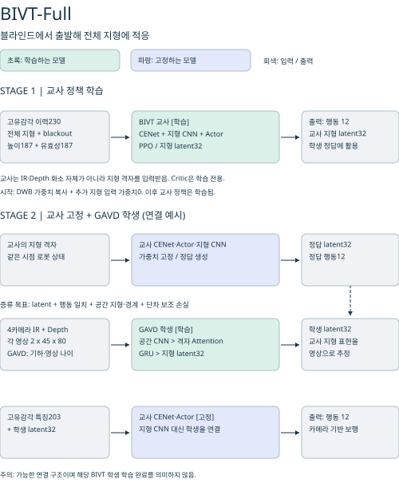
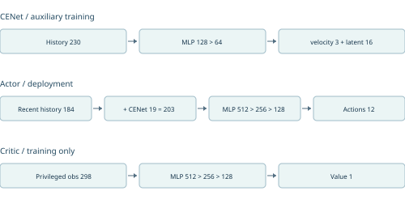
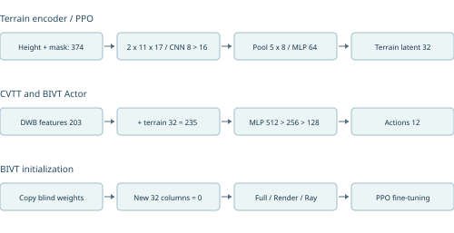
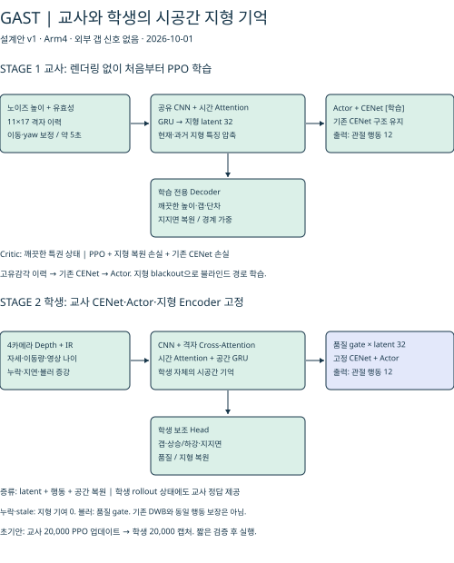

# RBQ10 학습 방법 비교

2026-09-30 · 5090 로컬 코드/체크포인트/실험 로그 기준

## 1. 읽는 법과 핵심 결론

이 약어들은 논문 공인 명칭이 아니라 프로젝트 내부 분류다. DWB·CVTT·BIVT는 교사 정책의 출처, RVLD·GAVD는 학생 증류 방식, BAVRL은 고정 블라인드 정책에 시각 잔차 행동을 더하는 RL 방식이다. 따라서 같은 층위의 여섯 알고리즘으로 순위를 매기면 안 된다.

- CVTT-6987 + GAVD-20000: 비전 교사 정책에 카메라 지형 latent 학생을 연결한다.
- DWB-38000 + BAVRL: 블라인드 CENet·Actor를 고정하고 시각 행동 보정만 학습한다. latent 교사 증류가 아니다.
- BIVT 교사 학습 20,000회와 GAVD 학생 증류 20,000회는 별도 단계다. BIVT 세 종류의 GAVD 20,000회 증류가 실행됐다는 의미가 아니다.
- 1이터의 단위가 다르다. 교사 PPO는 병렬 환경 rollout와 여러 SGD 갱신, 학생 증류는 촬영 횟수, BAVRL은 짧은 rollout와 잔차 PPO 갱신이다. 이터 수만 같다고 공정한 계산량 비교가 되지 않는다.
- base_contact 종료율과 갭 통과 성공률은 서로 다르다. 갭 지형에서 접촉 없이 timeout된 에피소드를 갭 통과 성공으로 계산하지 않는다.

## 2. 이름과 역할

| 약어 | 전체 이름 | 역할 |
|---|---|---|
| DWB | DreamWaQ Blind Baseline | 고유감각 기반 블라인드 보행 기준 정책 |
| CVTT | Camera-Visible Terrain Teacher | 카메라에서 보이는 지형 정보를 이용하는 교사 |
| BIVT | Blind-Initialized Visual Teacher | 블라인드 정책에서 초기화한 지형 관측 교사 |
| BIVT-Full | BIVT, Full Terrain (2-A) | 완전한 지형 관측을 쓰는 초기 적응 단계 |
| BIVT-Render | BIVT, Render Visibility (2-B) | 렌더 기반 가시성 및 blackout을 쓰는 교사 |
| BIVT-Ray | BIVT, Raycast Visibility (2-R) | 렌더 대신 raycast 가시성을 쓰는 교사 |
| RVLD | Recurrent Visual Latent Distillation | 공유 CNN + GRU 지형 latent 학생 |
| GAVD | Grid-Attention Visual Distillation | 공간 CNN + 격자 cross-attention + 기억 학생 |
| BAVRL | Blind-Anchored Visual Residual Learning | 동결 블라인드 보행 + 영상 잔차 PPO |

BIVT-Render v1/v2는 다른 네트워크 종류가 아니라 시작 체크포인트와 실행 설정이 다른 실험 분기다. 현재 로컬 이름 정의는 `gd_lab_vrl/README.md`에 있다.

<!-- pagebreak -->

<!-- pagebreak -->

<!-- pagebreak -->

<!-- pagebreak -->

<!-- pagebreak -->

<!-- pagebreak -->

<!-- pagebreak -->

<!-- pagebreak -->

<!-- pagebreak -->

## 3. 교사 입력·신경망·PPO

### 3.1 공통 DWB 구조

참고: [DreamWaQ — Nahrendra·Yu·Myung, 2023](https://arxiv.org/abs/2301.10602)은 기반 방법이다. [PPO — Schulman 외, 2017](https://arxiv.org/abs/1707.06347)은 정책 최적화의 기반이다. 아래 차원·payload·설정은 논문 수치를 옮긴 것이 아니라 로컬 `rl/actor_critic.py`, `rl/cenet.py` 및 저장 체크포인트를 기준으로 한다.

한 시점의 정책 관측은 46차원이다: 각속도3 + 중력방향3 + 속도명령3 + 관절위치12 + 관절속도12 + 이전행동12 + payload1. 5시점 이력은 230차원이다. Actor가 직접 쓰는 최근 4시점은 184차원이다.

CENet은 관측 이력230 → MLP128 → 64 → 속도 추정3 및 latent16을 출력한다. latent에는 평균16/로그분산16의 VAE 분기가 있으며, 재구성 decoder는 코드19 → 64 → 128 → 다음 관측46이다. 속도 회귀·재구성·KL로 학습하며, 추론 때는 결정론적 평균을 사용한다.

Actor는 최근 관측184 + CENet 코드19 = 203 → 512 → 256 → 128 → 행동12, ELU MLP다. 초기화 로그에 먼저 찍히는 부모 Actor의 230 입력과 실제 교체된 Actor203을 혼동하지 않는다. Critic은 privileged 관측298 → 512 → 256 → 128 → V1이다. 여기에는 실제 선속도, 발 주변 높이/접촉/힘, 마찰, 질량, 게인, 외란 및 높이 스캔이 들어간다. 블라인드라는 말은 배포 Actor의 입력에 지형 영상이 없다는 뜻이지 학습 Critic까지 지형을 모른다는 뜻은 아니다.

저장된 DWB-38000 설정: clipped PPO ε=0.2, GAE γ=0.99/λ=0.95, 5 epochs, 4 minibatches, lr=0.001 adaptive KL(target0.01, 최소lr0.00003), entropy0.01, clipped value loss 계수1, grad norm1, 좌우 대칭 augmentation. rollout=100 steps/env. CENet은 별도 학습률0.001, β=1이며 AdaBoot를 사용한다. 실제 다른 실행은 저장된 agent.yaml을 우선한다.

### 3.2 CVTT 구조

참고: [DreamWaQ](https://arxiv.org/abs/2301.10602)와 [PPO](https://arxiv.org/abs/1707.06347)를 기반으로 한 프로젝트 확장이다. CVTT라는 이름의 별도 원논문은 확인되지 않았다. 구현 레퍼런스는 `src/gd_lab/teachers/cvtt/actor_critic.py`다. 카메라 가시 지형 마스킹과 latent32 연결을 DreamWaQ 원논문 자체의 구조라고 해석하지 않는다.

Actor 기본 관측과 CENet은 DWB와 같은 계열이다. 추가로 높이187 + 유효성187 = 374차원의 terrain 관측을 받는다. 11×17 격자의 2채널 입력 → Conv2d 2→8→16 (3×3, ReLU) → 5×8 pooling → Flatten640 → MLP64 → latent32(tanh)이다.

Actor는 203+32=235 → 512 → 256 → 128 → 12. Critic은 기존 privileged 입력298을 사용한다. PPO gradient가 terrain encoder까지 갱신한다. 렌더 영상 자체를 CNN Actor에 직접 넣는 교사가 아니라, 영상으로 정한 가시 영역의 지형 격자를 사용하는 구조다. 정책·PPO 기본 설정은 DWB를 상속하지만 rollout/env 수/다중 GPU 설정은 실행별로 다를 수 있다.

### 3.3 BIVT 구조

참고: 블라인드 기반은 [DreamWaQ](https://arxiv.org/abs/2301.10602), 학습 기반은 [PPO](https://arxiv.org/abs/1707.06347)다. Full·Render·Ray 세 변형은 프로젝트 구현이며 별도 원논문을 확인하지 못했다. 구현 레퍼런스는 `teachers/bivt/blind_init.py`, `actor_critic.py`, `tasks.py`와 `docs/teachers/bivt.md`다.

초기화에서는 블라인드 가중치를 복사하고 Actor 첫 층의 추가 지형 입력32열을 0으로 설정한다. 따라서 초기 행동은 블라인드와 같지만, 학습 후까지 동일성을 보장하지는 않는다. Full 단계에도 blackout이 적용된다.

CVTT 계열 Actor235 및 terrain CNN을 사용하되, 기존 블라인드 정책에서 초기화한다. 모든 지형 셀이 무효이면 terrain latent를 정확히 0으로 gate한다. 학습 중 blackout을 포함하여 무지형 관측에서 보행을 학습한다.

Full/Render/Ray의 핵심 차이는 지형 가시성 생성 방식이다. Render는 렌더 기반, Ray는 렌더 없는 raycast 기반으로 가시성을 만든다. BIVT의 Actor/CENet을 학습 중 계속 바꿀 수 있으므로, latent0이라고 원래 DWB-38000과 행동이 동일하다고 보장할 수 없다. 이는 블라인드 자체를 동결하는 BAVRL과 다른 점이다.

## 4. 학생과 잔차 학습 방법

### 4.1 RVLD: 공유 CNN + GRU

참고: `students/rvld/model.py` 주석은 [APT-RL: Agile perceptive multi-skill locomotion for quadrupedal robots in the wild — Kang 외, 2026](https://arxiv.org/abs/2607.13579)의 교사-학생 분리(Fig. 2iii)를 명시적으로 언급한다. 이는 전체 APT-RL 재현을 뜻하지 않는다. 로컬 RVLD에는 해당 논문의 전체 action pretraining·다중 스킬 Transformer 파이프라인이 없다. [Cho 외, 2014](https://arxiv.org/abs/1406.1078)는 GRU의 기반 레퍼런스이며 프로젝트의 직접 인용으로 확인된 것은 아니다.

학생 입력은 4카메라 × (Depth, IR proxy) × 45×80이다. 시뮬레이션 IR은 렌더 grayscale proxy이며 실제 적외선 센서의 광학 현상을 완전히 복제한 것이 아니다.

카메라마다 가중치를 공유하는 Conv 2→16(k5,s2)→32(k3,s2)→32(k3,s2), ReLU, pooling3×5, Flatten480→32를 거친다. 4개 특징을 연결한128 →64 → GRUCell64→latent32(tanh). 보조 hazard head는64→16→1로 최대 인접 높이 단차를 예측한다.

고정 교사 terrain latent에 대한 MSE와 hazard 보조 손실로 학생을 학습한다. 배포에서는 기존 교사 CENet·Actor를 유지하고 terrain encoder 대신 학생 latent를 연결한다. 학생 자체에는 별도 PPO Actor/Critic이 없다. 촬영/지연 packet 단위 학습이며 GRU BPTT와 학습률은 실행 설정을 확인해야 한다.

### 4.2 GAVD: 격자 Attention 학생

참고: 프로젝트 자체 학생 구조다. [Attention Is All You Need — Vaswani 외, 2017](https://arxiv.org/abs/1706.03762)은 scaled dot-product attention의 기반 레퍼런스이며, 전체 Transformer를 재현하지 않는다. [DAgger — Ross·Gordon·Bagnell, 2011](https://arxiv.org/abs/1011.0686)은 학생이 방문한 상태에 교사 정답을 붙이는 방식과 관련된 개념이다. 현재 구현은 고전적 데이터셋 누적 DAgger의 그대로인 구현은 아니다. 두 논문 모두 직접 참조 이력이 확인된 것으로 표기하지 않는다. 실제 구현은 `students/gavd/model.py`, `distillation.py`다.

입력 영상은 RVLD와 같다. CNN 2→16→32 (3×3,s2, ELU)로 공간 특징을 유지하고, 카메라마다144 token, 총576 token을 만든다. 카메라 ID embedding과 기하정보8차원(xyz, 광선방향, 유효성/unknown)을 더한다.

11×17=187개 지형 query가 32차원 key/value에 scaled dot-product cross-attention을 수행한다. 현재 구현은 단일 attention이며 대형 multi-head Transformer가 아니다. LayerNorm + FFN32→64→32 뒤 공간 head가 높이·유효성·상승경계·하강경계·지지면 proxy의5개 값을 출력한다.

187×32 특징 →63, 영상 나이를 포함해 입력64 → GRUCell(hidden63) → latent32. 외부 인터페이스 기억64의 마지막 슬롯은 출력 시 0으로 예약되며, 실제 시간 입력은 별도로 제공한다. 정확한 자세 보정 BEV 역투영은 아니며 카메라 기하 embedding을 사용한다. CNN 출력은 bilinear 보간으로9×16이 된다(pooling이 아님). 상승·하강 경계 지도는 x방향 인접 높이 차이 기준이며 지지면은 평탄성 proxy다.

확인한 실행의 목표는 latent MSE + 0.5×hazard MSE + 행동 MSE + 0.5×공간 손실이다. 고정 Actor에 학생 latent를 넣은 행동이 교사 행동을 따르도록 한다. 초기1,000 촬영 이후4,000 촬영에 걸쳐 학생 행동 rollout 비율을 올린다. 카메라별8% drop augmentation, packet 지연/누락을 적용한다. lr0.0003, BPTT8, 64env, 촬영70~100ms, 지연0~150ms, packet drop5%다. capture 수와 optimizer 갱신 수는 같지 않다.

### 4.3 BAVRL: 고정 블라인드 + 행동 보정

참고: 고정 기준 정책은 [DreamWaQ](https://arxiv.org/abs/2301.10602), 최적화는 [PPO](https://arxiv.org/abs/1707.06347) 기반이다. [Residual Reinforcement Learning for Robot Control — Johannink 외, 2018](https://arxiv.org/abs/1812.03201)은 기존 제어에 학습 잔차를 더한다는 관련 개념 레퍼런스다. 직접 참조 이력이나 그 논문의 정확한 재현으로 확인한 것은 아니다. 동결 CENet·Actor, 영상 freshness gate와 제한된 보정은 로컬 `residuals/bavrl/model.py`, `ppo.py` 구현을 따른다.

현재 설정은 이터당512개 transition에4 epochs×16 minibatches=64 optimizer 갱신이다. BAVRL value loss는 일반 MSE이며, DWB의 clipped value loss와 구분한다.

학생 latent를 교사 latent에 맞추는 증류가 아니다. DWB-38000 CENet·Actor·관측 정규화는 동결하고 GAVD 시각 인코더와 잔차 MLP를 환경 보상으로 학습한다.

잔차 Actor 입력은 블라인드 특징203 + 영상latent32 + 이전잔차12 + 나이1 = 248 →128→64→12 (ELU). 최종층은0 초기화. 행동은 동결 블라인드 행동 + 제한된 잔차다. tanh 잔차 한계±0.2, tick당 변화±0.02는 policy action 단위이며 scale0.25 적용시 관절각 최대 보정±0.05rad이다.

Critic은 블라인드 Critic298→512→256→128→1의 독립 복사본을 학습한다. PPO는 raw Gaussian sample의 log-probability를 사용한다. lr0.0003, clip0.2, γ0.99, λ0.95, value0.5, entropy0.001, 잔차 크기/변화 penalty0.01, 공간 보조0.1, gradient clipping1. 현재32env×horizon16=512 transitions/iter, 4epochs, batch32다.

영상 없음/invalid/250ms 초과 시 잔차와 이전잔차를0으로 만들어 같은 관측에서 원래 블라인드 행동과 같게 한다. 물리 상태까지 원래 블라인드 궤적으로 돌아간다는 보장은 없다. 이 즉시 복귀가 slew 제한보다 우선하므로 전환 충격은 별도 검증 대상이다. 현재 GRU는 단일 촬영 truncated gradient이고 긴 sequence BPTT가 아니다. 학습 기본 지연0~100ms, packet drop5%이며 카메라별 고장 augmentation은 아직 없다.

## 5. 확인한 모델 파일과 상태

| 경로/방법 | 교사 파일 | 학생·잔차 파일 / 상태 |
|---|---|---|
| DWB → BAVRL | teachers/blind/arm4_38000/teacher/model_38000.pt | bavrl_1000.pt 시험 완료; 총20,000회 재개 중 |
| CVTT → GAVD | 6987_top1.pt (launch 복사본 teacher.pt) | perception_20000.pt, 64env 증류 완료 |
| CVTT → RVLD | 배포 평가 패키지 model_5674_top1.pt | perception_20000.pt, env128 버전 평가 기록 |
| CVTT → RVLD 과거 | model_3700.pt / model_3879_top1.pt / model_4125_top2.pt | 각각12400/20000/20000 학생 패키지 보유 |
| BIVT-Render v1 로컬 수신본 | teachers/bivt/render_v1_final_20260930/teacher/model_1299.pt | strict load 확인; 대응 GAVD 학생 미확인 |
| BIVT-Ray / Render v2 | 다중 GPU 담당에게 현재 파일 확인 요청 | 로컬에 없는 모델을 임의로 짝짓지 않음 |

표의 Top1/Top2는 해당 보관 파일명이다. 과거 대화의 랭킹 표현이 달라도 임의로 파일명을 바꾸지 않는다. online Top5 점수는 학습 rollout proxy이며 held-out 검증 순위가 아니다.

BAVRL 현재 run: `logs/bavrl/dwb38000_bavrl_20000_resume1000_20260930/`. 1,000회 체크포인트에서 추가19,000회로 총20,000회를 목표로 한다. 문서 조사 중3,221회 로그와 `bavrl_3200.pt` 저장을 확인했다. 이후 숫자는 계속 바뀐다. 원래1,000회 배포 번들과 전용 스크립트는 유지한다.

## 6. 이터 시간과 예상 학습 시간

| 방법 | 실측 단위/조건 | 초/이터 | 요청한 기준 시간 |
|---|---|---|---|
| DWB 교사 | 실행 로그 시간 미확인 | 미확인 | 40,000회 산출 보류 |
| CVTT 교사 | 다중 GPU 담당 확인 대상 | 미확인 | 40,000회 산출 보류 |
| BIVT 각 교사 | 다중 GPU 담당 확인 대상 | 미확인 | 40,000회 산출 보류 |
| RVLD 학생 | env128 패키지 보유, 학습 시간 로그 미확인 | 미확인 | 20,000회 산출 보류 |
| GAVD 학생 | 5090,64env,20,000 captures, learning wall7797.65초 | 0.3899 | 2시간9분58초 실측 |
| BAVRL 잔차 PPO | 5090,32env,horizon16,50→1000 저장 시간975초/950회 | 1.0263 | 총20,000회 환산5시간42분; 잔여19,000회5시간25분 |

BAVRL은 학생 증류 시간이 아니라 잔차 RL 시간이다. 초기화·평가·export·기타 GPU 부하를 제외한 단순 환산이며, 잔여는 여유를 두어5.5~6.5시간으로 안내했다. 재개 시 물리 상태·curriculum·센서 queue/RNG는 복원하지 않는다. 시간을 늘린다고 특정 지형 성공을 보장하지 않는다.

비교 공식: 교사40k시간=실측 초/이터×40,000÷3,600. 학생20k시간=실측 초/capture×20,000÷3,600. PPO에서 transitions/iter=전체env×horizon이며 GPU별env인지 전체env인지 먼저 확인한다. GPU 종류/개수와 학생의 촬영·BPTT 수가 다르면 이터 시간을 직접 비교하지 않는다.

## 7. 실험 결과와 해석

### 7.1 CVTT-5674 + RVLD-20000: Isaac 고정 난도 평가

2026-09-29 저장 자료, 난도0.65, 전체256env, 6,000 simulation steps, 학생 입력 지연0~50ms/drop5%. 분모는 각 조건의 완료 에피소드 수다. 지형별 평균을 다시 평균하지 않고 종료 건수를 합산했다.

| 입력 조건 | 전체 base_contact / 종료에피소드 | 전체율 | 갭 base_contact / 갭 종료에피소드 | 갭 접촉 종료율 |
|---|---|---|---|---|
| 교사 terrain latent | 26 / 201 | 12.94% | 4 / 63 | 6.35% |
| RVLD 카메라 학생 | 16 / 196 | 8.16% | 2 / 63 | 3.17% |
| 지형 모양 제거 flatscan | 27 / 200 | 13.50% | 8 / 65 | 12.31% |
| terrain latent=0 | 1877 / 1887 | 99.47% | 941 / 942 | 99.89% |

이 자료만으로 RVLD가 교사보다 낫다고 일반화할 수 없다. 표본·지형 배치 및 stochastic rollout의 차이가 있고 반복 seed 신뢰구간이 없다. 하지만 이 조건에서 지형 latent 제거가 크게 악화되는 증거다. latent0은 DWB 모델이 아니다. CVTT Actor에 비정상 입력을 준 것이므로 블라인드 모델 성능으로 인용하면 안 된다.

### 7.2 RVLD의 MuJoCo 영상 대조

2026-09-30 07:05 기록, 같은 CVTT-5674+RVLD env128 배포. 평지 live는 목표x4.7m 도달. 계단 live는 x4.139m에서 시간 종료(목표 미달), 계단 flat 영상은 x2.777m에서 자세/속도 한계로 중단. 갭 live/flat은 각각x2.489/x2.057m에서 횡방향/높이 한계로 중단했다.

이 비교는 영상 조건이 보행에 영향을 준다는 관찰이며, 갭 통과 성공을 입증하지 않는다. 단일 시행을 통계적 base_contact율로 바꾸지 않는다. 따라서 RVLD가 모든 방법 중 가장 나쁘다는 순위도 확정할 수 없다.

### 7.3 BAVRL-1000 MuJoCo 결과

2026-09-30 21:50 기록. 4카메라 실제 MuJoCo IR+Depth 입력, 공통 지형 원점 평지, Arm4 gain, payload6kg, 100Hz Actor. 속도0 WALK20초: 최대 roll/pitch0.919°, 관절속도0.532rad/s. 0.18m/s 전진30초: 최대 기울기3.994°, 관절속도10.239rad/s, yaw 최대18.40°. 전도/자동중단 없이 STAND 복귀했지만 방향 편차가 남았다.

별도 학생 수신 probe의60초 표본11790개에서 missing0, 최대age381ms, age≥250ms1990개(16.9%)였다. 이는 별도 인스턴스 수치이며 Pilot의 정확한 fallback 비율은 아니다. Pilot에서도310~336ms 및 freshness 전환 로그를 확인했다.

base_contact율·갭 종료율은 미측정이다. 첫 갭x12m에 도달하지 않은 평지 테스트를 갭 성공률0%/100%로 환산하지 않는다. 무영상 residual0은 ONNX 계약 검사로 확인했으나 스트림 차단 보행은 미실시다. 계단/갭 및20,000회 모델 성능은 아직 미검증이다.

### 7.4 GAVD-20000

학습 완료 로그의 마지막 latent MSE0.02653, hazard MSE0.00327은 증류 오차이지 접촉 종료율이 아니다. 현재 수집한 자료에서는 GAVD 전용 base_contact·갭 종료율을 확인하지 못했다. RVLD 실험 결과를 GAVD 결과로 옮겨 쓰지 않는다.

## 8. 장점·단점·선택 기준

| 방법 | 장점 | 단점·주의 |
|---|---|---|
| DWB | 카메라/지연에 독립적, 비교 기준이 단순 | 접촉 전 갭·계단을 직접 미리 볼 수 없음 |
| CVTT | 지형 latent와 행동을 PPO로 함께 최적화 | 렌더 비용, 교사-카메라 학생 간 차이, latent 누락 취약 가능 |
| BIVT-Full | 이미 학습한 블라인드에서 시작 | 완전 지형에서 제한된 시야로 바뀔 때 분포 차이 |
| BIVT-Render | 실제 렌더 가시성과 blackout에 적응 | 렌더가 비싸고 초기화 분기별 성능 분리 필요 |
| BIVT-Ray | 렌더 비용을 줄인 가시성 학습 | 실제 영상 노이즈/재질/깊이 결손과의 차이 |
| RVLD | 작은 CNN-GRU, 기존 Actor에 연결 쉬움 | 공간 압축으로 작은 경계가 소실될 수 있음; 단순 latent 손실 |
| GAVD | 공간 격자·행동·경계 지도를 함께 학습 | query 기하 오차, 연산/지연, 증류가 교사보다 나은 행동을 보장하지 않음 |
| BAVRL | 블라인드 동결, 영상 장애 시 정확한 행동 복귀 계약 | 작은 보정 한계, 지연 경계 전환, 현재짧은 기억학습·성능 미검증 |

다음 공정 비교는 동일 지형/seed/명령/게인/payload/카메라·지연 조건에서 각 정책을 반복 평가하고, 완료 에피소드와 갭 진입/통과 횟수를 별도로 저장하는 방식이다. 계산 예산 비교에는 env-steps·촬영 수·SGD 갱신 수·GPU시간을 함께 보고한다.

## 9. 출처와 미확인 범위

소스·체크포인트 대조: DWB Actor 첫 가중치512×203, CVTT512×235, 공통 Critic512×298, BAVRL 잔차128×248을 확인했다. GAVD GRU의 입력 가중치189×64는 hidden63의 세 gate와 일치한다. CENet 코드에는 PPO gradient를 흘리지 않으며 보조 손실로 학습한다. 관측 이력은 term-major 저장이고 Actor에는 최근4개를 최신순으로 전달한다. CVTT terrain 관측은 Critic 입력과 별도 그룹이다.

논문 링크는 각 방법 바로 아래에 배치했다. ‘기반’은 구성 알고리즘의 출처, ‘명시 참조’는 코드 주석으로 확인된 연결, ‘관련 개념’은 이해를 돕기 위한 비교다. 프로젝트 내부 약어를 논문의 공식 알고리즘명이나 저자들의 구현으로 오인하지 않는다. 구조도의 수치는 논문이 아니라 로컬 구현을 나타낸다.

로컬 학습 루트: `/home/user/gd_project/gd_lab_vrl`. 배포 루트: `/home/user/gd_project/gd_rbq10_deploy_vrl`. 아래는 로컬 상대경로다.

- 약어: README.md; 구조: src/gd_lab/agents/dreamwaq_ppo_cfg.py, methods/dreamwaq/spec.py, rl/actor_critic.py, rl/cenet.py.
- 교사: src/gd_lab/teachers/cvtt/actor_critic.py, bivt/actor_critic.py, bivt/blind_init.py; DWB checkpoint의teacher/params/agent.yaml.
- 학생: src/gd_lab/students/rvld/model.py, gavd/model.py, gavd/distillation.py, scripts/distill_student.py.
- BAVRL: src/gd_lab/residuals/bavrl/model.py, ppo.py, scripts/train_bavrl.py; logs/bavrl/의run.json 및체크포인트.
- GAVD 시간: logs/arm4_teacher6987_attention_20k_20260930.console.log의learning_wall_seconds=7797.65 및 해당run의params/env.yaml.
- 평가율: 배포logs/isaac_eval_5674_env128_20260929_232120/diff_0.65.json; experiments/isaac_eval/eval_latent_sources.py.
- 영상 대조: 배포logs/terrain_vision_check_20260930_070515/config.json, summary.json.
- BAVRL 시험: 배포bavrl/README.md 및logs/bavrl1000_walk_zero.json, bavrl1000_forward.json.

다중 GPU 담당 대화 '다중 GPU 비전 RL 학습 모니터'에 원격10.77.32.231의 실행 설정·시간·성능을 요청했다. 두 차례 요청 모두 완료 상태로 표시됐으나 답변 본문이 비어 반환됐고, 요청한 공유 자료 파일도 생성되지 않아 이번 판본에는 원격 실측을 확정하지 못했다. 해당 항목은 미확인으로 남겼다. 로컬 코드 기본값만으로 원격 실행의 실제 설정을 확정하지 않는다. 본 문서는 로컬 근거 기반 1차본이며 원격 담당의 유효 응답 수신 후 보완이 필요하다.

<!-- pagebreak -->

## 추가: 교사·학생·시각 보정 조합표 (2026-10-01)

출발 정책, 교사 추가 학습, 학생 증류, 시각 행동 보정은 서로 다른 선택 축이다. 아래는 구현된 구성요소로 계획할 수 있는 조합이며, 모든 조합의 연결·학습·배포가 검증됐다는 뜻은 아니다. 앞 절의 실측과 상태는 9월 30일 기록이며, 이 절의 보유 상태는 10월 1일 기준이다.

| 번호 | 출발 | 교사 / 추가 학습 | 학생 | 시각정보 활용 | 현재 상태 |
| --- | --- | --- | --- | --- | --- |
| 1 | DWB | 추가 없음 | 없음 | 영상 없는 블라인드 기준선 | 배포 가능 |
| 2 | DWB | 블라인드 정책 고정 | 증류 없음 | BAVRL 비전 잔차 행동 PPO | DWB-38000 기반 시험 완료 |
| 3 | DWB | BIVT-Full | RVLD | 전체 높이 스캔 교사를 CNN-GRU로 증류 | 신규 실험 |
| 4 | DWB | BIVT-Full | GAVD | 전체 높이 스캔 교사를 Attention으로 증류 | 신규 실험 |
| 5 | DWB | BIVT-Render | RVLD | 렌더링 가시 지형 교사를 CNN-GRU로 증류 | v1 교사 보유; 학생 미학습 |
| 6 | DWB | BIVT-Render | GAVD | 렌더링 가시 지형 교사를 Attention으로 증류 | v1 교사 보유; 학생 미학습 |
| 7 | DWB | BIVT-Ray | RVLD | Raycast 가시 지형 교사를 CNN-GRU로 증류 | 로컬 교사 미수신 |
| 8 | DWB | BIVT-Ray | GAVD | Raycast 가시 지형 교사를 Attention으로 증류 | 로컬 교사 미수신 |
| 9 | CVTT | 선택한 교사 고정 | RVLD | 카메라 가시 지형 교사를 CNN-GRU로 증류 | 5674 기반 배포 가능 |
| 10 | CVTT | 선택한 교사 고정 | GAVD | 카메라 가시 지형 교사를 Attention으로 증류 | 6987 기반 배포 가능 |

방법 기준 총 10조합이다. BIVT-Render v1/v2를 서로 다른 시작 체크포인트·실행 설정의 실험으로 나누면 5·6번이 각각 두 개가 되어 12조합이다. 체크포인트별 비교는 추가된다.

BAVRL에도 학습되는 시각 네트워크가 있지만 RVLD/GAVD 학생 증류와는 다르다. DWB의 CENet·Actor를 고정하고 환경 보상으로 행동 보정을 학습한다. CVTT + BAVRL 또는 학생 위에 BAVRL을 추가하는 조합은 현재 구현된 경로가 아니며 별도 설계가 필요하다.

<!-- pagebreak -->

## 추가: 공정한 비교를 위한 기준 실험

| 기준 실험 | 확인하려는 것 | 해석 시 주의 |
| --- | --- | --- |
| DWB 원본 단독 | 비전 추가 전 보행 성능 | 동일한 DWB 체크포인트를 비교 기준으로 고정 |
| CVTT/BIVT + 정답 지형 입력 | 교사 자체의 갭·계단 극복 능력 | 시뮬레이션 교사 평가이며 카메라 학생 성능이 아님 |
| 같은 교사 + RVLD / GAVD | 학생 구조에 따른 차이 | 교사·지형·시드·카메라 조건을 통일 |
| 정상 영상 / 누락·지연 영상 | 시각정보 기여 및 센서 강건성 | 동일 학생을 고정; 시간초과와 접촉 종료를 분리 |
| 같은 DWB + 보정 없음 / BAVRL | 시각 행동 보정의 실제 이득 | 게인·제어 주기·초기 상태를 통일 |

우선 비교는 CVTT-7761을 고정한 RVLD 대 GAVD이다. 7761은 f41a4be로 수신하고 체크포인트·설정 해시를 확인했으나, 현재 두 학생의 학습 실행기 준비와 시험 실행은 완료되지 않았다. 기존 5674-RVLD와 6987-GAVD는 교사가 달라 학생 구조만의 효과를 분리할 수 없다.

- BIVT-Render v1 보유 모델은 model_1299.pt이며 Top-1 선정 모델은 아니다. Full·Ray·Render v2의 별도 교사 패키지는 현재 로컬 보관 목록에서 확인되지 않았다.
- 새 교사에 기존 학생 가중치를 그대로 붙이지 않는다. 관측·latent·Actor 계약을 확인하고 해당 교사를 대상으로 증류한다.
- 비교 지표는 갭 통과율, 갭·계단 베이스 접촉 종료율, 시간초과율, 이동 거리, 자세·관절 속도 및 영상 지연을 함께 기록한다.
- 20,000회는 실행 길이를 맞추는 기준일 뿐 공정성의 충분조건은 아니다. env 수, 캡처 수, 유효 영상 수, 최적화 횟수와 실제 시간을 함께 기록한다.
- 온라인 Top-5 점수는 학습 rollout 기반 후보 선정 지표이며 독립 평가 성능이 아니다.
- d_v3.6.21_b1_18 기반 BAVRL 신규 학습은 사용자 요청으로 보류 중이다.

<!-- pagebreak -->

<!-- pagebreak -->

## GAST 설계 추가 - 2026-10-01

GAST: Gap-Aware Spatiotemporal Teacher-Student Learning. 프로젝트 신규 설계이며 기존 논문의 공식 명칭은 아니다. 갭뿐 아니라 평지와 계단을 함께 학습한다. 아래는 구현·검증할 사양이며 성능을 검증한 결과가 아니다. 앞 절의 실행 상태는 각 작성 시점의 기록이다.

### 교사 GAST-T: 노이즈 높이스캔 시공간 Denoising Autoencoder

Arm4 설정을 독립 gast/ 디렉토리로 복사한다. 물리 dt 0.005초, 제어 decimation 2(100 Hz), hip Kp 123.39, knee Kp 127.77, Kd 2.4 및 기존 CENet 구조와 보조 학습을 유지한다. 사전 DWB 가중치로 초기화하지 않고 처음부터 학습한다. 교사에는 카메라 센서를 만들지 않는다.

현재·과거 11×17 높이와 유효성 격자를 이동·yaw에 맞춰 현재 좌표로 보정한다. 최근은 촘촘히, 과거는 드물게 선택한 약 5초 이력을 공유 CNN, 시간 Attention, GRU로 처리하여 지형 latent 32를 만든다. 관측 나이와 유효성도 입력한다. PPO에는 이력을 관측으로 저장하여 rollout과 확률 재계산의 일관성을 유지한다.

학습 전용 Decoder는 깨끗한 높이, 유효성, 갭, 상승·하강 경계와 지지면을 복원한다. 경계·갭에 가중치를 주며 PPO와 복원 손실을 함께 사용한다. Critic은 깨끗한 특권 관측을 사용한다. 공간 출력은 센서의 외부 신호가 아니라 보조 학습 정답이다. CENet은 별도의 기존 경로로 유지한다.

### 학생 GAST-S: 영상 자체의 시공간 기억

네 카메라 Depth와 IR proxy를 공유 CNN으로 처리하고 격자 Cross-Attention으로 공간 특징을 만든다. 로봇 자세·이동량으로 지형 기억 위치를 보정하고, 시간 Attention과 격자 GRU로 통과 중 지형을 유지한다. 기존 GRU의 크기만 늘리는 접근은 사용하지 않는다. 학습 시퀀스는 앞발 접근부터 뒷발 통과까지의 시간 범위를 고려한다.

교사 CENet·Actor·Encoder는 고정하고 학생의 latent·행동·지형 복원을 학습한다. 학생 rollout에도 교사 정답을 제공한다. 외부 갭 센서는 사용하지 않으며 pose 오차·센서 지연은 추가 검증한다.

### 영상 불량과 블라인드 동작

교사는 지형 blackout으로 latent 0에서도 걷도록 학습한다. 학생은 누락·지연·블러와 품질 gate를 학습하며 누락/stale 시 지형 기여를 0으로 만든다. 무텍스처 평지를 블러로 오인하지 않도록 검증한다. 새 정책의 블라인드 경로이며 DWB-38000과 동일 행동을 보장하지 않는다.

### 실행 계획과 검증 기준

짧은 교사 학습·저장·복원과 학생 증류·저장·복원을 검증한 뒤 교사 20,000 PPO 업데이트 → 학생 20,000 영상 캡처를 실행한다. 각 초/회, env 수, 유효 영상 수, 최적화 횟수와 ETA를 기록한다. 학습 완료는 보행 성능 통과가 아니다.

평가: 네 발 갭 통과율, 앞발/뒷발 추락률, 갭·계단 base_contact 종료율, 착지 여유, 관절 속도, 영상 나이, 정상/누락/블러 조건을 구분한다. 32차원과 64차원, 기억 없음과 있음, 품질 gate 유무를 후속 비교한다. 학생 렌더링 비용은 남으며 총 시간은 짧은 실측 후 제시한다.

### 관련 연구

- [Miki et al., Learning robust perceptive locomotion for quadrupedal robots in the wild, 2022](https://arxiv.org/abs/2201.08117): 노이즈 지형 관측, recurrent encoder와 attention gate. 교사 clean / 학생 noisy 설정이며 본 설계와 완전히 같지는 않다.
- [Cheng et al., Extreme Parkour with Legged Robots, 2023](https://arxiv.org/abs/2309.14341): scandots 교사, Depth CNN-GRU 학생, 학생 상태에서 교사 행동 증류.
- [Masked Sensory-Temporal Attention for Sensor Generalization in Quadruped Locomotion, 2024](https://arxiv.org/abs/2409.03332): 센서·시간 attention과 masking 참고.
- [Learning Locomotion on Complex Terrain for Quadrupedal Robots with Foot Position Maps and Stability Rewards, 2026](https://arxiv.org/abs/2604.02744): 발 위치·지형 결합과 안정성 보상 참고. GAST의 효과를 입증하는 근거로 인용하는 것은 아니다.
